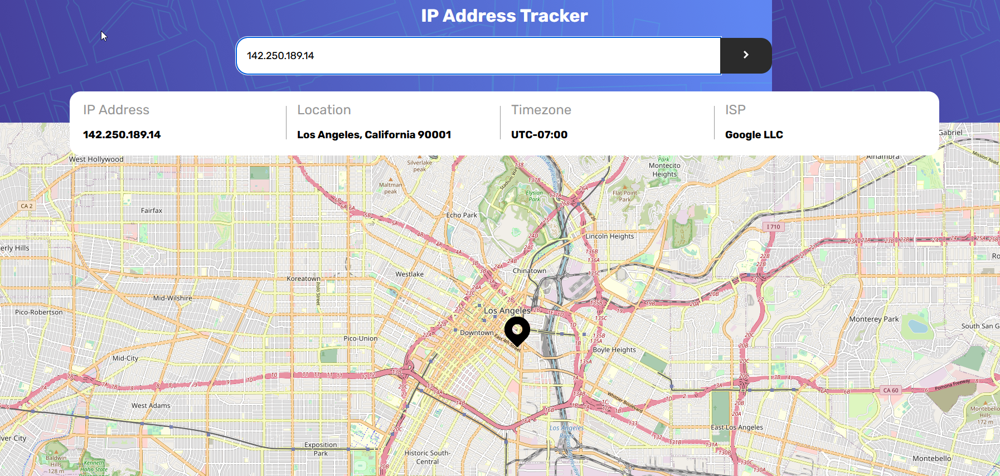
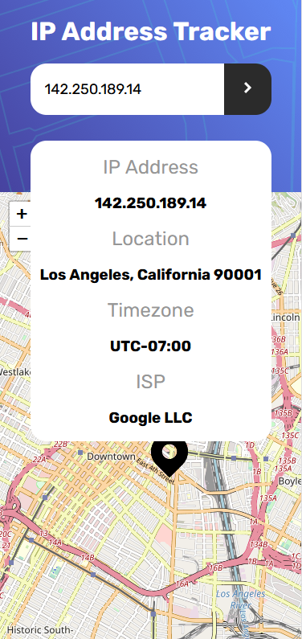

# Frontend Mentor - IP address tracker solution

This is a solution to the [IP address tracker challenge on Frontend Mentor](https://www.frontendmentor.io/challenges/ip-address-tracker-I8-0yYAH0). Frontend Mentor challenges help you improve your coding skills by building realistic projects.

## Table of contents

-   [Overview](#overview)
    -   [The challenge](#the-challenge)
    -   [Screenshot](#screenshot)
    -   [Links](#links)
-   [My process](#my-process)
    -   [Built with](#built-with)
    -   [Useful resources](#useful-resources)
-   [Author](#author)

## Overview

### The challenge

Users should be able to:

-   View the optimal layout for each page depending on their device's screen size
-   See hover states for all interactive elements on the page
-   See their own IP address on the map on the initial page load
-   Search for any IP addresses or domains and see the key information and location

### Screenshot

#### Desktop

#### Mobile

### Links

-   Github Repo: [Github Repo](https://github.com/cmdarcy/ipAddressTracker)
-   Live Site: [Live site](https://cmdarcy.github.io/ipAddressTracker/)

## My process

### Built with

-   Semantic HTML5 markup
-   CSS custom properties
-   Flexbox
-   CSS Grid
-   Mobile-first workflow

### Useful resources

-   [Ipify](https://geo.ipify.org/) - This was the api to call to search the domain/ip address
-   [Leaflet JS](https://leafletjs.com/) - This was the api used to integrate the map and marker feature
-   [Regular-Expressions.info](https://www.regular-expressions.info/ip.html/) - This helped me create the validation regex for ip Address checking.

## Author

-   Website - [Christopher d'Arcy](https://cmdarcy.github.io/portfolio_website/)
-   Frontend Mentor - [@cmdarcy](https://www.frontendmentor.io/profile/cmdarcy)
